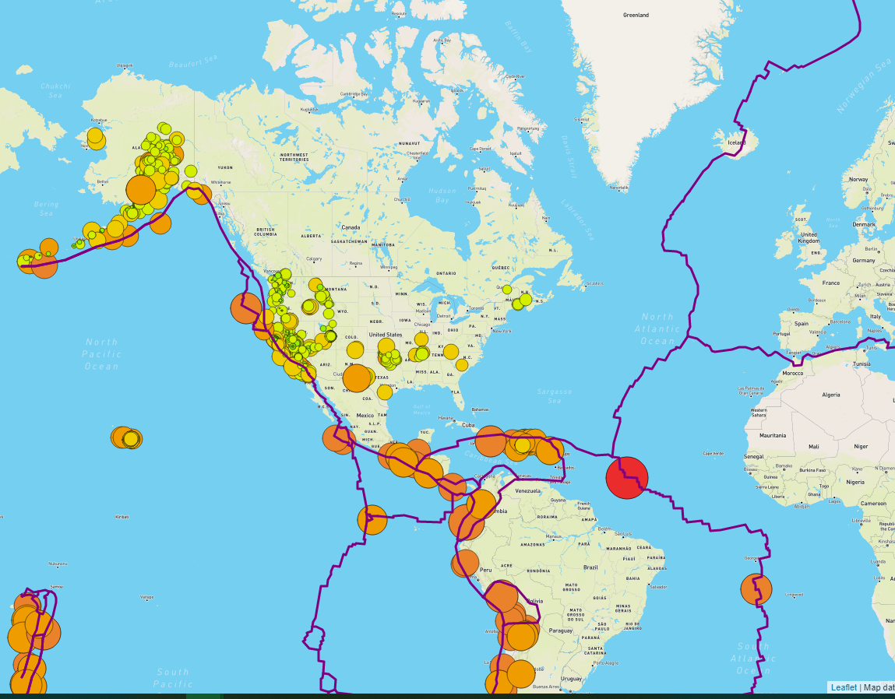
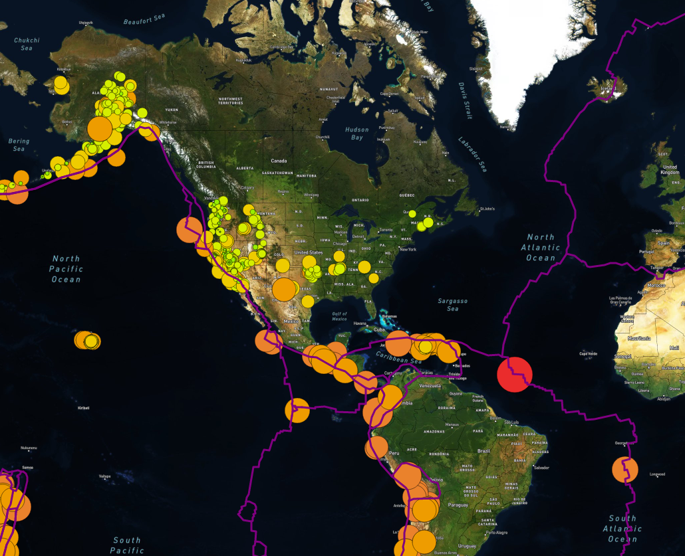
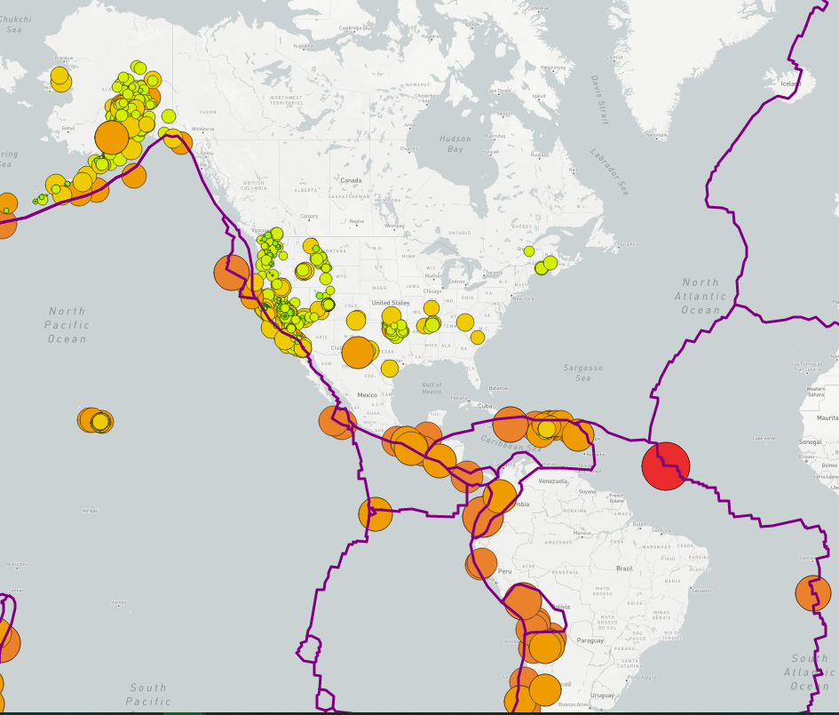
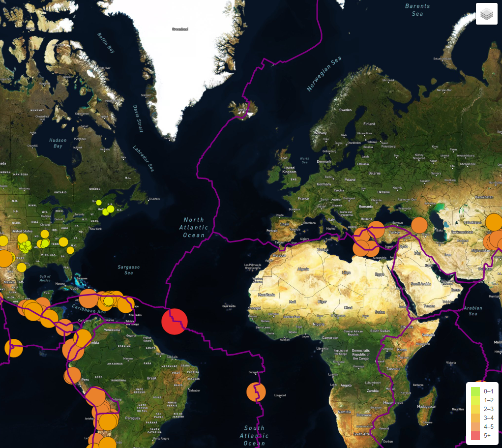

# Mapping_Earthquakes  
## Screenshots of Three Map Styles with All Layers Selected  
### Layers:  
- Earthquakes  
- Tectonic Plates  
- Major Earthquakes   

  
*Figure 1: Streets map style.*   

  
*Figure 2: Satellite map style.*   

  
*Figure 3: Light map style.*   

### Accomplished by Using:  
- JavaScript  
- CSS  
- HTML  
- Leaflet/GeoJSON/D3   

## Screenshot of Layer Icon and Legend  
